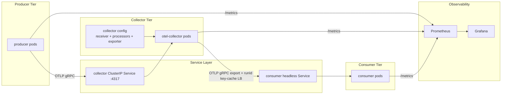

## 1. Scope

Design a Kubernetes-based, horizontally scalable telemetry pipeline in Go:
- A scalable chain of producers generates random compressed packages with bounded size.
- Producers send messages to otel-collector via OTLP gRPC.
- OTel Collector runs as a scalable tier in load-balancing mode with exporters.
- Export path distributes messages across a scalable consumer tier using OTLP gRPC.
- Load balancing uses key-based caching on runId to preserve stable routing for a given run.
- End-to-end delivery is validated through Grafana metrics reconciliation.

Out of scope for v1:
- Multi-region active-active routing.
- Exactly-once guarantees.
- Long-term historical analytics storage.

## 2. Design Goals

- Horizontal scalability for producers, collectors, and consumers.
- Deterministic payload bounds and format contract.
- Protocol correctness for OTLP gRPC transport.
- Operational resilience under pod restarts and burst load.
- Quantitative validation that sent, collector-received, and consumer-received totals reconcile.

## 3. High-Level Architecture



## 4. Component Design

### 4.1 Producer Service (Go)

Responsibilities:
- Generate random package envelopes.
- Enforce payload_min_bytes <= payload_size <= payload_max_bytes.
- Compress payload with configured algorithm (gzip or zstd).
- Send telemetry over OTLP gRPC to collector endpoint.
- Export producer counters and health metrics.

Key counters:
- okps_producer_messages_sent_total
- okps_producer_send_errors_total
- okps_producer_payload_bytes_total

### 4.2 OTel Collector Tier

Responsibilities:
- Receive OTLP gRPC payloads from producers.
- Process and route telemetry through configurable processors/exporters.
- Export packages to consumers via OTLP gRPC.
- Apply runId key-cached load balancing so all packages for the same runId are routed consistently.
- Export collector counters used for reconciliation.

Key counters (custom or derived pipeline counters):
- okps_collector_messages_received_total
- okps_collector_messages_exported_total
- okps_collector_export_errors_total

Notes:
- Collector service endpoint is stable via ClusterIP.
- Collector tier scales horizontally via HPA.
- Collector egress protocol to consumers is OTLP gRPC for protocol consistency.
- runId key cache should use bounded TTL/size to prevent unbounded memory growth while keeping sticky routing during active runs.

### 4.3 Consumer Service (Go)

Responsibilities:
- Receive exported telemetry from collector path.
- Decode and validate package envelope fields.
- Track message receipt and decoding failures.

Key counters:
- okps_consumer_messages_received_total
- okps_consumer_decode_errors_total

### 4.4 Service and Discovery Layer

- Collector ingress: ClusterIP Service on OTLP gRPC (4317).
- Consumer addressing: headless Service for direct endpoint discovery and fan-out behavior.
- DNS-based endpoint list supports scalable consumer group changes.
- Collector egress: OTLP gRPC to consumer endpoints discovered from headless Service.
- Routing policy: hash(runId) + key cache to keep per-run stickiness across collector export attempts.

## 5. Data and Message Contract

Envelope fields (minimum):
- message_id (unique string)
- producer_id
- created_at_unix_ms
- compression (gzip|zstd)
- original_size_bytes
- compressed_size_bytes
- payload (bytes)

Contract rules:
- original_size_bytes within configured limits.
- compressed_size_bytes <= original_size_bytes for compressible data patterns (not strictly guaranteed for all random data).
- message_id uniqueness best effort per producer instance.

## 6. Scaling Model

Scalable dimensions:
- producer_replicas
- collector_replicas
- consumer_replicas

Autoscaling baseline:
- Producers: optional HPA on CPU or custom rate target.
- Collectors: HPA on CPU + queue/backpressure proxy metric.
- Consumers: HPA on CPU and ingress rate per consumer.

Capacity guidance:
- Increase collectors when collector receive/export lag rises.
- Increase consumers when per-consumer receive rate saturates or decode latency increases.

## 7. Reliability and Failure Handling

- Producer retries with bounded exponential backoff and timeout.
- Collector pod disruption budget and rolling update strategy.
- Consumer idempotent handling by message_id when possible.
- Readiness/liveness probes for all tiers.
- On consumer endpoint churn, key-cache entries may be re-assigned with minimal redistribution while preserving active runId affinity when possible.

Failure scenarios to validate:
- collector pod restart during sustained load.
- consumer scale-down and scale-up rebound.
- temporary network interruption between collector and consumer.

## 8. Observability and Grafana Validation

### 8.1 Prometheus Query Set

Use a configurable window variable $metrics_window.

- producer_sent:
  sum(increase(okps_producer_messages_sent_total[$metrics_window]))

- collector_received:
  sum(increase(okps_collector_messages_received_total[$metrics_window]))

- consumers_received:
  sum(increase(okps_consumer_messages_received_total[$metrics_window]))

- collector_receive_ratio:
  collector_received / producer_sent

- consumer_receive_ratio:
  consumers_received / producer_sent

- collector_to_consumer_ratio:
  consumers_received / collector_received

### 8.2 Reconciliation Rules

Let tolerance = metrics_validation_tolerance_percent / 100.

Validation pass criteria:
- producer_sent > 0, collector_received > 0, consumers_received > 0 during active traffic window.
- abs(producer_sent - collector_received) / producer_sent <= tolerance.
- abs(collector_received - consumers_received) / collector_received <= tolerance.

Validation fail criteria:
- Any ratio panel drops below 1 - tolerance for more than one scrape interval.
- Any counter becomes non-monotonic unexpectedly.

### 8.3 Dashboard Panels

Required panels:
- Sent vs Collector Received vs Consumers Received (time series)
- Delta: producer_sent - collector_received
- Delta: collector_received - consumers_received
- Ratios: collector_receive_ratio, consumer_receive_ratio, collector_to_consumer_ratio
- Per-consumer distribution panel
- Error counters (send/export/decode)

Alert rules:
- Critical: sustained reconciliation failure over N intervals.
- Warning: ratio degradation trend approaching threshold.

## 9. Security and Operations

- Use least-privilege service accounts for producer, collector, and consumer workloads.
- Network policies restrict cross-tier traffic to required ports.
- TLS for OTLP gRPC where environment requires encryption in transit.
- Resource requests/limits on all deployments.

## 10. Deployment & Infrastructure

Final phase target environment:
- The full project must run on local Kubernetes provided by Docker Desktop.
- Deployment workflow must support fast local iteration and reproducible setup.

### 10.1 Container Image Requirements (Dockerfiles)

Producer and consumer services must each include production-oriented Dockerfiles:
- Multi-stage build (builder + runtime) to reduce image size.
- Non-root runtime user.
- Explicit `EXPOSE` for service/metrics ports.
- Configurable runtime parameters via environment variables.
- Health endpoint support aligned with readiness/liveness probes.
- Deterministic dependency handling (pinned module versions and reproducible builds).

Collector image strategy:
- Prefer official `otel/opentelemetry-collector-contrib` image.
- Mount collector configuration via ConfigMap.
- Avoid baking environment-specific collector config into image layers.

Image naming for local development:
- Use local tags suitable for Docker Desktop cluster pulls (for example, `okps-producer:dev`, `okps-consumer:dev`).
- If needed by local workflow, support imagePullPolicy `IfNotPresent` to reuse local images.

### 10.2 Configuration Requirements (ConfigMaps and Secrets)

ConfigMaps (non-sensitive configuration):
- Producer runtime config:
  - payload bounds
  - compression mode
  - send rate / concurrency settings
  - otel exporter endpoint
- Consumer runtime config:
  - validation toggles
  - decode behavior controls
  - metrics options
- Collector pipeline config:
  - receivers/processors/exporters
  - load-balancing and runId key-cache settings
  - telemetry/metrics endpoints

Secrets (sensitive configuration):
- TLS material for OTLP gRPC when enabled (cert/key/CA).
- Any future credentials/tokens for secured exporters or backends.
- Do not store secret values in plain manifest files; inject through Helm values and Kubernetes Secret resources.

Configuration principles:
- All environment-specific values must be externalized from container images.
- Default local values should be provided for Docker Desktop while allowing overrides via Helm values.

### 10.3 Kubernetes Manifests via Helm

All deployment resources must be managed through a Helm chart (single chart or parent chart with subcharts).

Required chart outputs:
- Namespace (optional toggle if namespace is pre-created).
- Deployments:
  - producer
  - otel-collector
  - consumer
- Services:
  - collector ClusterIP on 4317
  - consumer headless Service for endpoint discovery
  - optional metrics Services/ServiceMonitors where needed
- Autoscaling:
  - HPA for collector and consumer
  - optional HPA for producer
- PodDisruptionBudget for collector and consumer.
- ConfigMaps and Secrets.
- ServiceAccounts, Roles, and RoleBindings (least privilege).
- NetworkPolicies restricting traffic to required ports and tiers.
- Monitoring resources:
  - Prometheus scrape configuration or ServiceMonitor manifests
  - Grafana dashboard provisioning config
  - Prometheus alert rules for reconciliation signals

Helm structure requirements:
- `values.yaml` with sensible local defaults for Docker Desktop.
- `values.local.yaml` (or equivalent) for explicit local overrides.
- Clear separation of global values and per-component values.
- Template helpers for consistent naming and labels.
- Resource requests/limits configurable per component.

### 10.3.1 Helm Chart Folder Layout (Prescriptive)

Recommended layout:

```text
deploy/helm/okps/
  Chart.yaml
  values.yaml
  values.local.yaml
  charts/
  templates/
    _helpers.tpl
    namespace.yaml
    producer-deployment.yaml
    producer-service.yaml
    collector-deployment.yaml
    collector-service.yaml
    consumer-deployment.yaml
    consumer-headless-service.yaml
    configmap-producer.yaml
    configmap-consumer.yaml
    configmap-collector.yaml
    secret-tls.yaml
    hpa-producer.yaml
    hpa-collector.yaml
    hpa-consumer.yaml
    pdb-collector.yaml
    pdb-consumer.yaml
    serviceaccount.yaml
    role.yaml
    rolebinding.yaml
    networkpolicy.yaml
    prometheus-rules.yaml
    servicemonitor.yaml
```

Dependency and naming conventions:
- `Chart.yaml` should declare dependency versions explicitly when external charts are used (for example, kube-prometheus-stack fragments) and pin compatible ranges.
- Use a single naming helper pattern in `_helpers.tpl`, such as `<release>-okps-<component>`, for all objects.
- Apply Kubernetes recommended labels consistently (`app.kubernetes.io/name`, `app.kubernetes.io/instance`, `app.kubernetes.io/component`, `app.kubernetes.io/managed-by`).
- Keep per-component value blocks under `producer`, `collector`, and `consumer`; keep shared settings under `global`.
- Put local-only overrides (replicas/resources/image tags/endpoints) in `values.local.yaml`, without duplicating full defaults.

### 10.4 Local Docker Desktop Kubernetes Requirements

Operational requirements for local final-phase validation:
- Kubernetes context must target Docker Desktop cluster.
- Document one-command or short-sequence deploy flow, for example:
  - build local images
  - helm upgrade --install
  - verify rollout and metrics availability
- Provide cleanup command path (`helm uninstall` + optional namespace cleanup).
- Ensure default replica counts and resource requests are feasible on a laptop-class local cluster.

Validation on local cluster must confirm:
- Producer -> collector -> consumer OTLP gRPC path is healthy.
- Prometheus can scrape all tiers.
- Grafana reconciliation dashboard is populated.
- Reconciliation alerts and ratios behave as designed under basic load.

Expected generated artifacts:
- Go producer service source.
- Go consumer service source.
- Dockerfiles for producer and consumer.
- Collector config (receiver/processors/exporters) mounted from ConfigMap.
- Helm chart templates for all required Kubernetes resources.
- Monitoring definitions (Prometheus scrape/service monitor, Grafana dashboard JSON, alerting rules).

## 11. Test Strategy (Design Level)

- Functional: message contract validation end-to-end.
- Scale: producer and consumer horizontal scaling tests.
- Resilience: restart and interruption scenarios.
- Reconciliation: Grafana/Prometheus count matching gates.

Exit criteria:
- All functional tests pass.
- Reconciliation gates pass for steady-state and burst scenarios.
- No unbounded backlog growth under expected load profile.

## 12. Open Decisions

- Whether runId key-cache should be in-memory only or backed by shared state for stronger affinity across collector pod restarts.
- Whether to enforce strict message ordering per producer stream.
- Chosen implementation for zstd dependency and compatibility policy.
- HPA metric source selection for collector tier (CPU only vs custom metric).
